# Routa JS

<div align="center">

**Multi-Agent Coordination Platform for AI Development**

[](https://www.typescriptlang.org/)
[](https://nextjs.org/)
[](LICENSE)
[](CONTRIBUTING.md)

[Features](#features) • [Quick Start](#quick-start) • [Architecture](#architecture) • [Contributing](#contributing)

</div>

---

## Overview

**Routa.js** orchestrates AI agents to collaborate on complex development tasks through specialized roles and real-time coordination. Instead of a single AI handling everything, Routa enables multiple agents to work together—one plans, another implements, and a third verifies—creating a more robust and scalable development workflow.

### What It Does

- **Breaks down complex work** into manageable tasks across specialized agents
- **Coordinates execution** through task delegation, messaging, and event streaming
- **Verifies quality** with dedicated review agents before completion
- **Connects multiple AI platforms** (Claude Code, OpenCode, Codex, Gemini) through unified protocols
- **Provides real-time visibility** into agent activities, task progress, and collaboration

### Key Capabilities

- **🎭 Role-Based Agents**: ROUTA (Coordinator), CRAFTER (Implementor), GATE (Verifier), DEVELOPER (Solo)
- **🔄 Task Orchestration**: Create tasks, delegate to agents, track dependencies, parallel execution
- **💬 Inter-Agent Communication**: Message passing, conversation history, completion reports
- **📡 Multi-Protocol Support**: MCP, ACP, A2A for connecting diverse AI clients
- **🎯 Skills System**: OpenCode-compatible skill discovery and dynamic loading
- **📊 Real-Time UI**: Live agent status, task progress, streaming chat interface

👉 For detailed protocol specs and API reference, see [AGENTS.md](AGENTS.md)

## 🚀 Quick Start

### Local Development

```bash
# Install dependencies
npm install --legacy-peer-deps

# Start development server
npm run dev
```

Visit `http://localhost:3000` to access the web interface.

### Deploying to Vercel

Routa.js can be deployed to Vercel, but requires a remote OpenCode server since serverless platforms cannot run CLI processes.

#### Step 1: Set up OpenCode Server

On a VPS or local machine with a public IP:

```bash
# Install OpenCode
npm install -g opencode-ai

# Start the server (accessible from internet)
opencode serve --host 0.0.0.0 --port 4096
```

#### Step 2: Deploy to Vercel

1. Fork this repository
2. Import to Vercel
3. Add environment variable:
   - `OPENCODE_SERVER_URL` = `http://your-server-ip:4096`
4. Deploy!

#### Alternative: Use API-based Providers

Instead of OpenCode, you can use API-based providers that work natively in serverless:

```bash
# Set one or more API keys
OPENAI_API_KEY=sk-...
ANTHROPIC_API_KEY=sk-ant-...
GOOGLE_API_KEY=...
DEEPSEEK_API_KEY=sk-...
```

See [.env.example](.env.example) for all configuration options.

## 🏗 Architecture

```mermaid
flowchart TB
    subgraph clients["🖥️ AI Clients"]
        claude["Claude Code"]
        opencode["OpenCode/Codex"]
        gemini["Gemini CLI"]
        a2a_ext["External Agents"]
    end

    subgraph browser["🌐 Web Interface"]
        chat["Chat Panel"]
        agents["Agent Panel"]
        skills["Skill Panel"]
    end

    subgraph server["⚙️ Routa Server"]
        mcp["MCP Server<br/>/api/mcp"]
        acp["ACP Agent<br/>/api/acp"]
        a2a["A2A Bridge<br/>/api/a2a"]
        rest["REST APIs"]

        subgraph core["Core Engine"]
            tools["Coordination Tools"]
            orchestrator["Orchestrator"]
            system["Stores & EventBus"]
            skill_reg["Skill Registry"]
        end
    end

    claude -.->|"SSE + JSON-RPC"| mcp
    opencode -.->|"stdio + JSON-RPC"| acp
    gemini -.->|"stdio + JSON-RPC"| acp
    a2a_ext -.->|"HTTP + JSON-RPC"| a2a

    chat -->|"WebSocket"| acp
    agents -->|"REST"| rest
    skills -->|"REST"| rest

    mcp --> tools
    acp --> tools
    acp --> skill_reg
    a2a --> tools
    rest --> system

    tools --> orchestrator
    orchestrator --> system
    skill_reg --> system

    classDef clientStyle fill:#e1f5ff,stroke:#0288d1,stroke-width:2px
    classDef browserStyle fill:#fff3e0,stroke:#f57c00,stroke-width:2px
    classDef serverStyle fill:#f3e5f5,stroke:#7b1fa2,stroke-width:2px
    classDef coreStyle fill:#e8f5e9,stroke:#388e3c,stroke-width:2px

    class claude,opencode,gemini,a2a_ext clientStyle
    class chat,agents,skills browserStyle
    class mcp,acp,a2a,rest serverStyle
    class tools,orchestrator,system,skill_reg coreStyle
```



## 👥 Agent Roles & Workflow

```mermaid
sequenceDiagram
    participant User
    participant ROUTA as 🎯 ROUTA<br/>(Coordinator)
    participant CRAFTER as 🔨 CRAFTER<br/>(Implementor)
    participant GATE as ✅ GATE<br/>(Verifier)

    User->>ROUTA: Complex task request
    activate ROUTA

    Note over ROUTA: Analyzes requirements<br/>Creates task breakdown
    ROUTA->>ROUTA: create_task("Implement feature X")
    ROUTA->>ROUTA: create_task("Add tests")

    ROUTA->>CRAFTER: delegate_task(task_id, specialist="CRAFTER")
    activate CRAFTER
    Note over CRAFTER: Spawns ACP process<br/>Receives task context

    CRAFTER->>CRAFTER: Implements changes
    CRAFTER->>CRAFTER: Writes code
    CRAFTER->>ROUTA: report_to_parent(success, summary)
    deactivate CRAFTER

    ROUTA->>GATE: delegate_task(task_id, specialist="GATE")
    activate GATE
    Note over GATE: Reviews implementation<br/>Runs verification commands

    GATE->>GATE: Checks acceptance criteria
    GATE->>GATE: Validates quality
    GATE->>ROUTA: report_to_parent(verdict, report)
    deactivate GATE

    alt Verification Approved
        ROUTA->>User: Task completed ✓
    else Needs Fix
        ROUTA->>CRAFTER: delegate_task(fix_task_id)
        Note over CRAFTER,GATE: Iteration continues...
    end

    deactivate ROUTA
```



| Role | Purpose | Behavior |
|------|---------|----------|
| **ROUTA** | Coordinator | Plans work, breaks down tasks, delegates to specialists, orchestrates workflow |
| **CRAFTER** | Implementor | Executes implementation tasks, writes code, makes minimal focused changes |
| **GATE** | Verifier | Reviews work, validates against acceptance criteria, approves or requests fixes |
| **DEVELOPER** | Solo Agent | Plans and implements independently without delegation (single-agent mode) |

## 📄 License

- Built with [Model Context Protocol](https://modelcontextprotocol.io/) by Anthropic
- Uses [Agent Client Protocol](https://github.com/agentclientprotocol/sdk) for agent communication
- Uses [A2A Protocol](https://a2a-js.github.io/sdk/) for agent federation
- Inspired by the [Intent](https://www.augmentcode.com/product/intent) - multi-agent coordination patterns in modern AI
  systems

This project is licensed under the MIT License - see the [LICENSE](LICENSE) file for details.

---

<div align="center">

**[⬆ back to top](#routa-js)**

Made with ❤️ by the Routa community

</div>
