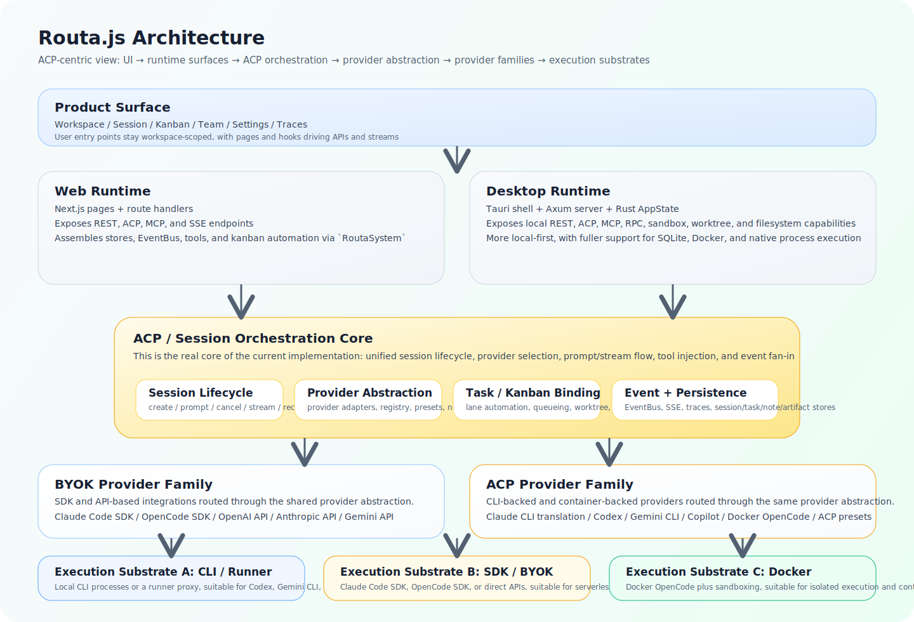
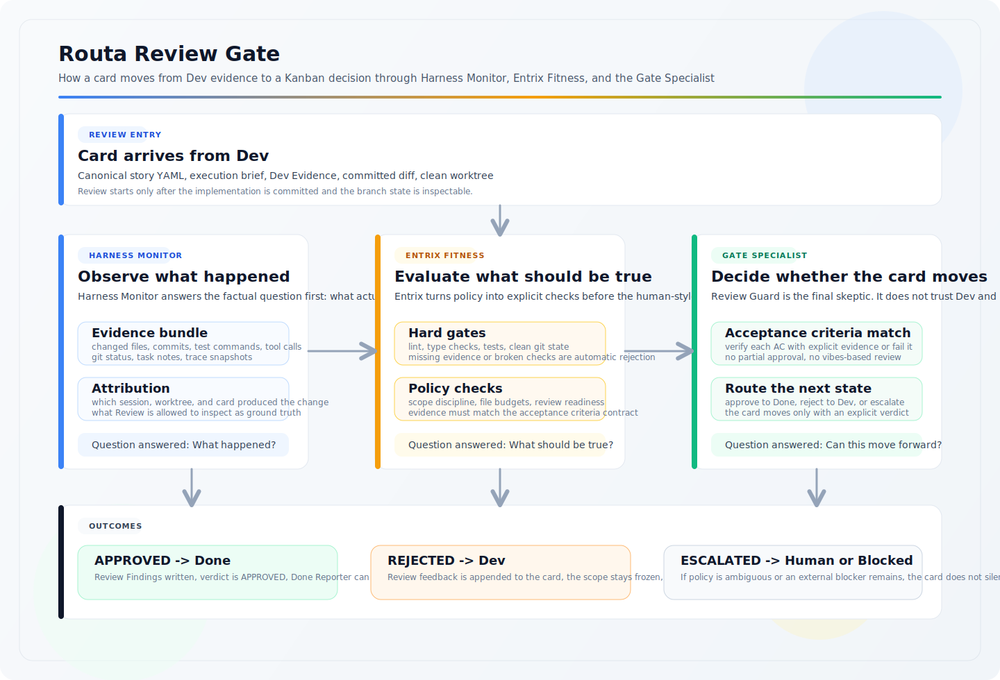

<div align="center">


# Routa

**以工作区为核心、面向软件交付的多智能体协同平台**

[](https://www.typescriptlang.org/)
[](https://nextjs.org/)
[](https://github.com/tokio-rs/axum)
[](LICENSE)
[](https://join.slack.com/t/routa-group/shared_invite/zt-3txzzfxm8-tnRFwNpPvdfjAVoSD6MTJg)
[](https://www.npmjs.com/package/routa-cli)
[](https://crates.io/crates/routa-cli)

[演示](#演示) • [架构](#架构) • [工作流程](#工作流程) • [为什么是 Routa](#为什么是-routa) • [快速开始](#快速开始) • [文档](#文档) • [English](README.md)

</div>

---

Routa 是一个以工作区为核心的多智能体协同平台，面向真实的软件交付流程。它把目标、任务、会话、追踪、证据和评审状态放回看板，而不是让这些信息淹没在单一聊天线程里。

[版本发布](https://github.com/phodal/routa/releases) · [架构文档](docs/ARCHITECTURE.md) · [功能树](docs/product-specs/FEATURE_TREE.md) · [快速开始](docs/quick-start.md) · [文档站点](https://phodal.github.io/routa/) · [Slack](https://join.slack.com/t/routa-group/shared_invite/zt-3txzzfxm8-tnRFwNpPvdfjAVoSD6MTJg) · [贡献指南](CONTRIBUTING.md)

## 演示

- [Bilibili 演示视频](https://www.bilibili.com/video/BV16CwyzUED5/)
- [YouTube 演示视频](https://www.youtube.com/watch?v=spjmr_1AQLM)


## 架构

### 系统架构



当前实现是有意保持双后端一致性的，而不是“一个 Web demo 加一个独立桌面端”。

- Web：`src/` 中的 Next.js 页面与路由处理器
- Desktop：`apps/desktop/` 中的 Tauri 壳，后端由 `crates/routa-server/` 的 Axum 服务提供
- 共享边界：两端都遵守 `api-contract.yaml` 定义的 workspace、session、task、trace、codebase、worktree 和 review 语义
- 集成表面：ACP、MCP、A2A、AG-UI、A2UI、REST 与 SSE

### Review Gate 架构



交付 Gate 不是一个 reviewer 角色，而是一条分层决策路径。

- Harness Monitor 负责回答“到底发生了什么”，它暴露 traces、改动文件、执行命令、git 状态和归因信息
- Entrix Fitness 负责回答“哪些事情必须成立”，它执行 hard gates、证据要求以及文件预算或策略检查
- Gate Specialist 负责回答“这张卡是否可以继续前进”，它逐条验证 acceptance criteria，并决定进入 Done、打回 Dev 或升级到人工处理

## 工作流程

```text
你："构建一个包含登录、注册和密码重置的用户认证系统"
                                                            ↓
                                    Workspace + 看板
                                                            ↓
 Backlog              Todo              Dev               Review            Done
 Backlog Refiner  ->  Todo Orchestrator -> Dev Crafter -> Review Guard -> Done Reporter
                                                            ↘
                                                                Blocked Resolver
```

Routa 把看板同时当成规划界面和协同总线。关键点在于：每个泳道背后都是不同的 specialist prompt，而且下游泳道会故意比上游更严格。

可以把它理解成两层 specialist 同时工作：

- 核心角色层：ROUTA 负责协调，CRAFTER 负责实现，GATE 负责验证
- 看板泳道层：每个列都有自己的 prompt 合同和证据合同

### 端到端过程

1. 你用自然语言描述目标。
2. ROUTA 或看板自动化把这个目标变成 workspace 范围内的卡片。
3. Backlog Refiner 把粗糙需求改写成 canonical YAML story，里面必须有 acceptance criteria、constraints、dependencies 和 INVEST 快照。
4. Todo Orchestrator 不信任上游卡片，会重新解析 YAML，退回质量不足的卡片，并补出可以直接执行的 brief。
5. Dev Crafter 再次检查计划是否可执行，只有在 story 足够清晰时才开始编码；它只实现卡片范围内的变更，运行验证，提交代码，并追加 Dev Evidence。
6. Review Guard 不信任 Dev 的自评，会逐条独立验证 acceptance criteria，要求测试证据和干净的 git 状态，然后要么打回 Dev，要么批准进入 Done。
7. Done Reporter 追加一个简短的完成总结，说明交付了什么，以及依靠什么证据判定它已完成。
8. 如果工作被环境、依赖或需求歧义阻塞，Blocked Resolver 会把阻塞原因写清楚，并把卡片路由回正确泳道，而不是让问题继续隐式存在。

### 泳道合同

| 泳道 | Specialist | Prompt 强制要求 | 会写回卡片的内容 | 典型交接 |
| --- | --- | --- | --- | --- |
| Backlog | Backlog Refiner | 只澄清范围，不允许编码；除非卡片里存在且仅存在一个 canonical YAML story block，否则不能推进 | Canonical YAML story，包含问题陈述、验收标准、影响范围、依赖、out-of-scope 与 INVEST 检查 | 只有 story 可解析且可独立执行时才移动到 Todo |
| Todo | Todo Orchestrator | 重新验证 Backlog 产物，拒绝格式错误或模糊卡片，把有效 story 变成 execution-ready brief | Execution Plan、Key Files and Entry Points、Dependency Plan、Risk Notes | 只有实现者能在几分钟内开工时才移动到 Dev |
| Dev | Dev Crafter | 再次确认卡片真的可执行，只实现范围内改动，运行验证，提交代码，并保持 git 干净 | Dev Evidence，含修改文件、完成内容、测试记录、逐条 AC 验证、注意事项 | 只有存在提交且 worktree 干净时才移动到 Review |
| Review | Review Guard | 独立验证每条 acceptance criteria，拒绝缺失证据、scope creep、dirty git、lint 或类型检查失败 | Review Findings，含 verdict、逐条 AC 状态、发现的问题、评审备注 | 只有明确 APPROVED 才移动到 Done |
| Done | Done Reporter | 把 Done 视为终态，不再向后推进，只留下简明 completion note | Completion Summary，含交付内容、关键证据和完成时间 | 保持在 Done |
| Blocked | Blocked Resolver | 分类 blocker、解释根因，只有在存在明确下一步时才重新路由 | Blocker Analysis，含 blocker type、root cause、resolution、routing decision | 返回 Backlog、Todo、Dev、Review，或继续停留在 Blocked |

### 卡片产物会逐步变严格

同一张卡片会随着流转不断补充结构化产物：

- Backlog 产出 canonical story YAML
- Todo 产出 execution brief
- Dev 产出实现与验证证据
- Review 产出正式 verdict 与 findings
- Done 产出 completion summary

这也是为什么看板不只是视觉状态。每推进一列，下一位 specialist 能信任的内容都会被重新定义。

### 看板背后的核心 Specialist Prompt

- ROUTA Coordinator：先做计划，绝不直接改文件，先写 spec，等用户批准，再按 wave 委派实现，并在实现后拉起 GATE 做验证。
- CRAFTER Implementor：严格待在任务范围内，不做顺手重构，不做 scope creep；如果有文件冲突需要先协调；按任务要求运行验证并做小步提交。
- GATE Verifier：只对 acceptance criteria 负责，证据不足就不算通过，不允许部分批准，输出必须是明确 verdict，而不是模糊判断。

内置的 Kanban 泳道 prompt 在 `resources/specialists/workflows/kanban/*.yaml`，核心角色 prompt 在 `resources/specialists/core/{routa,crafter,gate}.yaml`。

## 为什么是 Routa

单一 Agent 聊天适合处理孤立任务，但一旦同一条线程同时承担拆解、实现、评审、证据收集和发布决策，语义边界就会迅速混乱。

Routa 把这些职责显式化：

- 工作从 workspace 开始，而不是隐式的全局仓库状态
- 看板泳道负责在不同 specialist 之间路由工作，而不是把所有角色揉进一个 prompt
- 会话、追踪、笔记、产物、代码库和 worktree 都是持久化对象
- Provider 运行时通过适配层做标准化，而不是把各家的协议差异直接暴露到产品层
- Review 边界是一个真正的交付 Gate，而不是另一个带主观看法的 reviewer

## 当前能力

- 创建以 workspace 为范围的 overview、Kanban、session、team 和 codebase 视图
- 运行 Agent 会话，并支持 create、prompt、cancel、reconnect、streaming 与 trace 检查
- 通过队列和每个看板的自动化策略在 specialist 泳道之间路由任务
- 管理本地仓库、worktree、文件搜索、Git refs 和提交检查
- 将 GitHub 仓库导入为虚拟 workspace，并浏览目录树、文件、issue、PR 和评论
- 接入 MCP 工具以及自定义 MCP server
- 用 schedule、webhook、background task 和 workflow run 驱动持续自动化
- 基于 findings、severity、trace、harness signals 和 fitness report 做评审
- 以 local-first desktop 模式运行，或以 self-hosted web 模式部署

## 快速开始

按你的使用方式选择最短路径。

| 入口 | 适合谁 | 开始方式 |
| --- | --- | --- |
| Desktop | 完整产品体验、可视化流程、本地优先 | 从 [GitHub Releases](https://github.com/phodal/routa/releases) 下载 |
| CLI | 终端优先工作流与脚本化使用 | `npm install -g routa-cli` |
| Web | 自托管或浏览器优先接入 | 从源码运行 |

### Desktop

1. 从 [GitHub Releases](https://github.com/phodal/routa/releases) 下载 Routa Desktop。
2. 创建一个 workspace。
3. 启用一个 provider。
4. 关联一个仓库。
5. 先用 Session 做临时任务，或直接进入 Kanban 做路由式交付。

### CLI

```bash
npm install -g routa-cli

routa --help
routa -p "解释这个仓库的架构"
routa acp list
routa workspace list
```

### Web

```bash
npm install --legacy-peer-deps
npm run dev
```

打开 `http://localhost:3000`。

## 从源码开发

### Web 运行时

```bash
npm install --legacy-peer-deps
npm run dev
```

### Desktop 运行时

```bash
npm install --legacy-peer-deps
npm --prefix apps/desktop install
npm run tauri:dev
```

### Docker

```bash
docker compose up --build
docker compose --profile postgres up --build
```

Tauri 的本地 smoke 路径会通过桌面壳访问 `http://127.0.0.1:3210/`。

## 验证

把 [docs/fitness/README.md](docs/fitness/README.md) 视为权威验证规则手册。

```bash
cargo build -p entrix
entrix run --dry-run
entrix run --tier fast
entrix run --tier normal
npm run test
npm run test:e2e
npm run api:test
npm run lint
```

## 仓库地图

| 路径 | 作用 |
| --- | --- |
| `src/app/` | Next.js App Router 页面与 API 路由 |
| `src/client/` | 客户端组件、hooks、view model 与 UI 协议辅助层 |
| `src/core/` | TypeScript 领域服务：ACP/MCP、Kanban、workflow、trace、review、harness 与 stores |
| `apps/desktop/` | Tauri 桌面壳与打包 |
| `crates/routa-core/` | 共享的 Rust 运行时基础层 |
| `crates/routa-server/` | 供 desktop 与本地服务模式使用的 Axum 后端 |
| `crates/routa-cli/` | CLI 入口与 ACP 服务命令 |
| `crates/harness-monitor/` | 运行观测、评估以及面向操作员的 harness monitor |
| `docs/ARCHITECTURE.md` | 权威架构边界与不变量 |
| `docs/adr/` | 架构决策记录 |
| `docs/product-specs/FEATURE_TREE.md` | 自动生成的路由与端点清单 |
| `docs/fitness/` | 验证规则与质量门禁 |

## 文档

- [架构总览](docs/ARCHITECTURE.md)
- [ADR 索引](docs/adr/README.md)
- [快速开始](docs/quick-start.md)
- [功能树](docs/product-specs/FEATURE_TREE.md)
- [Fitness 规则](docs/fitness/README.md)
- [Harness Monitor 架构](docs/harness/harness-monitor-run-centric-operator-model.md)
- [贡献指南](CONTRIBUTING.md)
- [安全说明](SECURITY.md)

## 社区

- [文档站点](https://phodal.github.io/routa/)
- [Slack 社区](https://join.slack.com/t/routa-group/shared_invite/zt-3txzzfxm8-tnRFwNpPvdfjAVoSD6MTJg)
- [版本发布](https://github.com/phodal/routa/releases)
- [Issues](https://github.com/phodal/routa/issues)

## 许可证

MIT。见 [LICENSE](LICENSE)。
