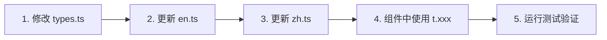

# i18n 快速参考

## 不同文件类型使用规范

| 文件类型 | 导入方式 | 示例 |
|---------|---------|------|
| 客户端组件 | `useTranslation()` Hook | `const { t } = useTranslation()` |
| 服务端组件 | 直接导入字典 | `import en from "@/i18n/locales/en"` |
| 自定义 Hook | `useTranslation()` Hook | 同客户端组件 |
| 工具函数 | 参数传入 `t` | `function fn(t: TranslationDictionary)` |
| 类型文件 | 仅导入类型 | `import type { Locale } from "@/i18n"` |
| 测试文件 | Mock Hook | `vi.mock("@/i18n", ...)` |
| API 路由 | 直接导入字典 | `import { dictionaries } from "@/i18n/locales"` |

### 导入路径规范

```typescript
// ✅ 推荐 - 统一入口
import { useTranslation, type Locale } from "@/i18n";

// ✅ 服务端/工具 - 直接字典
import en from "@/i18n/locales/en";

// ❌ 避免 - 内部模块
import { I18nContext } from "@/i18n/context";
```

## 新增翻译键流程



## 代码模板

### 1. 添加新翻译键

```typescript
// src/i18n/types.ts
export interface TranslationDictionary {
  yourModule: {
    yourKey: string;
  };
}
```

### 2. 填写翻译

```typescript
// src/i18n/locales/en.ts
yourModule: {
  yourKey: "Your English text",
}

// src/i18n/locales/zh.ts
yourModule: {
  yourKey: "你的中文文本",
}
```

### 3. 组件中使用

```typescript
import { useTranslation } from "@/i18n";

function Component() {
  const { t } = useTranslation();
  return <div>{t.yourModule.yourKey}</div>;
}
```

## 常用命令

```bash
# 运行 i18n 测试
npm test -- i18n

# 检查翻译完整性
npm run test:i18n

# 查看变更
git diff src/i18n/
```

## 键名规范速查

| 模块 | 前缀 | 示例 |
|------|------|------|
| 通用 | `common.*` | `t.common.save` |
| 首页 | `home.*` | `t.home.title` |
| 导航 | `nav.*` | `t.nav.settings` |
| 设置 | `settings.*` | `t.settings.language` |
| 错误 | `errors.*` | `t.errors.generic` |

## 检查清单

提交前检查:

- [ ] `types.ts` 中定义了新键
- [ ] `en.ts` 中填写了英文
- [ ] `zh.ts` 中填写了中文
- [ ] 运行 `npm test -- i18n` 通过
- [ ] 组件中使用 `t.xxx` 而非硬编码
