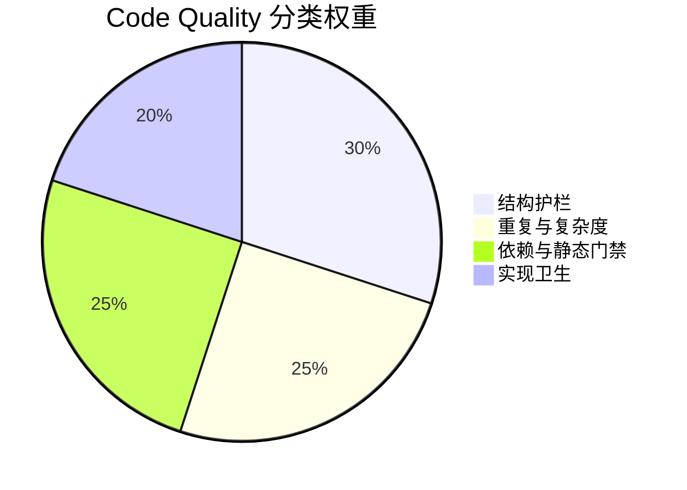

# Code Quality 证据

> 本文件检测 AI 生成代码的常见质量问题，作为 maintainability 维度的补充证据。
>
> **核心理念**: 通过量化指标约束 AI 的"乱写空间"，防止代码膨胀和质量退化。

## 检测矩阵

### 分类视图（适配 Code Quality 适应度函数）



| 分类 | 子权重 | 关注点 | 代表指标 |
|------|--------|--------|----------|
| 结构护栏 | 30% | 文件/函数预算、脚本入口膨胀、blast radius | `legacy_hotspot_budget_guard`, `file_line_limit`, `graph_blast_radius_probe` |
| 重复与复杂度 | 25% | 复制粘贴、结构性重复、认知负担 | `duplicate_code_ts`, `ast_grep_structural_smells`, `cyclomatic_complexity` |
| 依赖与静态门禁 | 25% | 依赖图、Lint、TypeScript/Rust 静态门禁 | `dependency_cruiser_dependency_health`, `eslint_pass`, `clippy_pass` |
| 实现卫生 | 20% | 调试残留、类型逃逸、实现噪音 | `console_log_check`, `any_type_check`, `todo_fixme_count` |

> `code_quality` 仍然是总 Fitness 的一个维度（24%），但维度内部不再用“19 个平铺指标”沟通，而是先按 4 个分类看风险，再下钻到具体 metric。

### 指标清单

| 分类 | 检测项 | 阈值 | Hard Gate | 工具 |
|------|--------|------|-----------|------|
| 结构护栏 | 文件行数 | 新文件 ≤1000 行，历史超标文件按 HEAD 基线冻结 | ❌ | `python -m entrix.file_budgets` |
| 结构护栏 | 历史热点守护 | 已登记热点只允许缩小不允许继续膨胀 | ✅ | `python -m entrix.file_budgets --overrides-only` |
| 结构护栏 | scripts 根目录文件数 | 超标目录按基线冻结；当前目标上限 20，已超标时不得继续长大 | ❌ | `git ls-tree` + `find` |
| 结构护栏 | 函数行数 | ≤100 行 | ❌ | grep + 人工 |
| 结构护栏 | blast radius 探针 | 变更范围可解释、可视 | ❌ | `graph:impact` |
| 重复与复杂度 | 重复代码 | 变更文件不新增大块 clone | ❌ | jscpd |
| 重复与复杂度 | 结构坏味道 | 变更文件中结构型包装重复 = 0 | ❌ | ast-grep |
| 重复与复杂度 | 重复函数名 | 变更中新增重复名 = 0 | ❌ | git diff + grep |
| 重复与复杂度 | Rust 重复 impl | 可疑重复 impl = 0 | ❌ | grep |
| 重复与复杂度 | 圈复杂度 | 变更文件中新增 >15 复杂度函数 = 0 | ❌ | ESLint |
| 重复与复杂度 | 深层嵌套 | 新增 >3 层嵌套 = 0 | ❌ | git diff + grep |
| 依赖与静态门禁 | 依赖健康检查 | 循环依赖/依赖违规为 0 | ✅ | dependency-cruiser |
| 依赖与静态门禁 | ESLint | 0 errors | ✅ | ESLint |
| 依赖与静态门禁 | TypeScript 类型检查 | 0 errors | ✅ | smart typecheck |
| 依赖与静态门禁 | Markdown 外链 | 外链可达 | ✅ | markdown link checker |
| 依赖与静态门禁 | Clippy | 0 warnings | ✅ | Clippy |
| 实现卫生 | TODO/FIXME | <100 | ❌ | grep |
| 实现卫生 | console.log | 变更中新增数 = 0 | ❌ | git diff + grep |
| 实现卫生 | any 类型 | 新增 `any` = 0 | ❌ | git diff + grep |

## AI 特有问题

### 1. 代码膨胀
AI 倾向于生成冗长代码，缺乏抽象能力。

**约束**: 新文件 ≤1000 行；历史超标热点必须进入预算冻结，只能缩小不能继续长大；`scripts/` 根目录文件数采用冻结预算，目标收敛到 ≤20；函数 ≤100 行

### 2. 重复代码
AI 经常"复制粘贴"式生成，忽略已有实现。

**约束**: 仅检查本次变更文件，且只抓大块复制，避免为压全仓 clone 数做跨语义抽象

### 2.1 结构性重复
文本重复不一定等于坏设计，真正危险的是成批出现的结构性包装代码。

**约束**: 用 `ast-grep` 只检查本次变更中的高风险结构模式

### 3. 类型逃逸
AI 使用 `any` 绕过类型检查。

**约束**: 本次变更不得新增 `: any` 或 `as any`

### 4. 调试残留
AI 遗留 console.log 和 TODO。

**约束**: 本次变更新增 console.log/debug = 0，TODO <100

## 本地执行

```bash
# 安装 jscpd
npm install -g jscpd

# 运行 dependency-cruiser 依赖健康检查（未安装时自动临时拉取）
npx --yes dependency-cruiser --config .dependency-cruiser.cjs src --validate
# 依赖图符合规则时会输出: no dependency violations found

# 运行变更文件重复检测
git diff --name-only --diff-filter=ACMR HEAD -- src apps

# 运行结构性模式检查（需安装 ast-grep）
ast-grep scan --help

# 运行 fitness 检查
entrix run
```

## 相关文件

| 文件 | 用途 |
|------|------|
| `eslint.config.mjs` | ESLint 配置 |
| `.clippy.toml` | Clippy 配置（如有） |
| `.dependency-cruiser.cjs` | dependency-cruiser 配置 |
| `docs/fitness/README.md` | Fitness 规则手册 |

## 适应度函数映射

`code_quality` 维度内部采用“分类 -> 指标”的两层解释：

1. 先看 4 个分类的权重和覆盖范围，判断问题是结构性风险、复杂度风险、静态门禁风险还是实现卫生风险；
2. 再下钻到具体 metric，定位哪一条检查失败；
3. 最终仍由 `entrix` 执行具体 metrics，但报表和图表统一按分类汇总，避免面对一长串平铺指标时失去重点。
