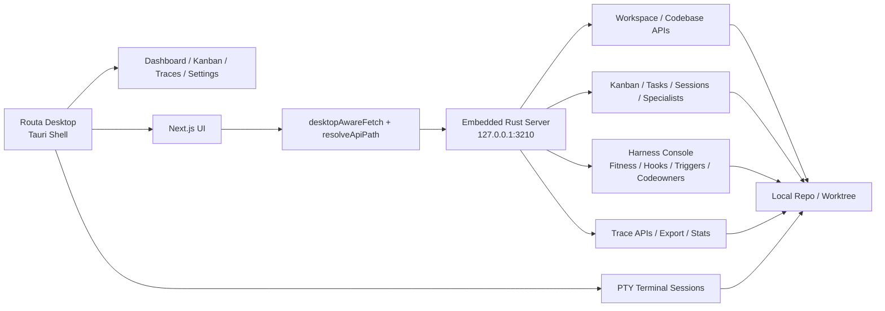
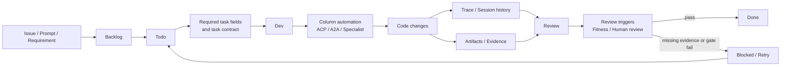

# Routa 桌面版发布：Harness 内建的 AI Coding 研发协作工作台

Routa 桌面版发布了。

如果只把它理解成一个新的 AI Coding 客户端，重点还是偏了。今天不缺能接模型、能开会话、能执行命令、能并行跑几个 Agent 的工具，真正稀缺的是另一种能力：当 Agent 进入真实研发现场之后，系统如何接住它、约束它、组织它，并把结果重新纳入软件交付。

所以我更愿意把 Routa 定义为一个 **Harness 内建的 AI Coding 研发协作工作台**。它不是先做生成，再在外面补治理；而是先把 Harness 做进系统，再决定任务如何流动、职责如何拆分、需要留下哪些证据，以及什么情况下结果才能继续推进。AI Coding 的瓶颈正在从“能不能写”转向“能不能交付”，Routa 想解决的正是后者。

## 先把 Harness 做进系统

很多 AI Coding 产品仍然以会话为中心。这当然适合展示模型能力，但软件交付本质上不是一连串局部输出，而是一条持续推进的流：任务进入系统，状态被推进，职责被切换，结果被验证，部分工作被阻断，最后只有少数结果真正进入交付。

这也是我理解 Routa 的三个关键点：

1. **Kanban 承载任务阶段**。任务不再被压扁进单条会话，而是带着 Backlog、Todo、Dev、Review、Done、Blocked 这些阶段语义向前流动。
2. **Specialists 承载职责边界**。multi-agent 的重点不是数量，而是把谁负责收敛、谁负责实现、谁负责验证这件事显式化。
3. **Gate、Evidence、Fitness 承载完成条件**。系统不只要推动工作，更要在证据不足、规则不满足时把工作挡下来。

没有 Harness，Agent 只是更快地产生结果；有了 Harness，系统才开始有能力拒绝那些不该进入下一阶段的结果。

## 这件事已经开始落地

Routa 桌面版现在的实现，已经不是“先有观点，后补产品”。相反，很多关键面已经在系统里接上了。

具体看，至少有四条实现线已经比较清楚：

1. **桌面端已经是稳定宿主，而不是聊天壳。** 桌面静态运行时会把 `/api` 请求自动转到本地 `127.0.0.1:3210` 的内建 Rust 后端；桌面菜单也已经把 `Dashboard`、`Kanban Board`、`Agent Traces`、`Settings` 做成一等入口。同时，桌面端内建了 PTY，会话可以直接挂住真实终端和真实仓库。
2. **Kanban 已经不是 UI 装饰，而是任务流骨架。** 当前列模型已经内建 `backlog / todo / dev / review / done / blocked`，并支持列自动化、`requiredArtifacts`、`requiredTaskFields`、`contractRules`、`deliveryRules`、`autoAdvanceOnSuccess`。Kanban 页面本身也不是只拉卡片，而是同时把 boards、tasks、sessions、specialists、repo changes 一起拉起来。
3. **Specialist 已经不是几个名字，而是可配置的职责层。** 当前 specialist 配置是落库的，支持 CRUD、role、model tier、provider、adapter 等映射；角色也已经明确分成 `ROUTA`、`CRAFTER`、`GATE`、`DEVELOPER`。这意味着 multi-agent 不再只是“多开几个模型”，而是职责边界开始成为系统配置的一部分。
4. **Harness 已经有控制面，而不是停留在口号。** Harness Console 现在已经把 fitness specs、execution plan、architecture quality、hooks、instructions、GitHub Actions、spec sources、design decisions、codeowners、automations 这些面板组织起来。Traces API 也已经支持按 workspace、session、file、eventType 查询和导出；在 harness-monitor 侧，`coverage_report`、`screenshot`、`human_approval` 这类 evidence 类型也已经进入完成条件判断。

## 任务流和完成条件，正在变成系统能力

如果说上面的实现说明 Routa 不是空概念，那么下面这条流更能说明它想把什么组织回系统里。

这条流的重点，不是“我们也有看板”，而是任务终于开始以阶段、职责和证据一起存在。卡片进入 Dev，不只是状态变化，还可以触发 ACP / A2A / specialist automation；工作做完，也不只是把卡片拖进 Done，而是要经过 trace、evidence、review triggers、fitness 这些信号。系统开始回答的，不只是“谁在做”，而是“凭什么它可以往前走”。

所以我更愿意把 multi-agent 理解成 Harness 的职责编排，把 Kanban 理解成 Harness 的任务界面，把 gate、evidence、fitness 理解成系统对“完成”的正式定义。Routa 的差异化不在于能不能多跑几个 Agent，而在于系统有没有能力把“差不多完成了”挡在门外。

## 为什么这次必须是桌面版

也正因为如此，这次发布必须是桌面版。

如果 Routa 想做的是一套 Harness 内建的 AI Coding 研发协作工作台，它就需要一个足够稳定的宿主，去长期挂住本地仓库、workspace、session、task、trace、evidence 和验证执行。网页可以承载一次会话，桌面版才更像一个持续存在的研发环境。

所以，这次桌面版发布，真正被发布出来的，不只是一个新入口，而是这套 Harness-first 方法第一次有了更完整的产品承载体。它让我们看到的，不只是“AI 能写什么”，而是“AI Coding 系统应该怎样接入真实软件交付”。

Routa 想做的，不是让 Agent 更像人，而是让 AI Coding 更像真正的软件交付。而桌面版，是这个判断第一次比较完整地落地。
